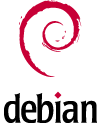

# piu (Platform Independant Updater)


**`piu` makes cross-platform package management stink less.**

`piu` is an all-in-one wrapper for different package managers. It was
born out of frustration over constantly typing the wrong command or
passing the wrong flags when on different Linux distros.


### Features
* `piu` works the same across distros, no more memorising each package
  manager and its quirks
* Auto-update package repositories if they're old when installing or
  upgrading the system (no need for additional flags).
* Includes a built-in option to install locally downloaded packages,
  even when the standard package manager doesn't support that; such as
  `dpkg` vs. `apt`
* Print the number of updates available, suitable for use in a status
  bar or shell scripts
* `sudo` automatically if additional permissions are needed. *No more...*
```
E: Could not open lock file /var/lib/dpkg/lock - open (13: Permission denied)
E: Unable to lock the administration directory (/var/lib/dpkg/), are you root?
```
* And most important: *less typing!* Compare `piu u` to `apt update && apt upgrade`

> since `piu` is a wrapper, it doesn't contribute *[to the problem](https://xkcd.com/927/)*

### Currently Supports

> *[Alpine Linux](https://alpinelinux.org/),*
> *[Arch Linux](https://www.archlinux.org/),*
> *[Debian](https://www.debian.org/),*
> *[elementary OS](https://elementary.io/),*
> *[Fedora](https://getfedora.org/),*
> *[macOS](https://www.apple.com/macos/),*
> *[Manjaro](https://manjaro.org/),*
> *[Linux Mint](https://www.linuxmint.com/),*
> *[SteamOS](http://store.steampowered.com/steamos/),*
> *[Ubuntu](https://www.ubuntu.com/), and*
> *[Void Linux](https://voidlinux.org/)*

 &nbsp;
 &nbsp;
 &nbsp;
 &nbsp;

&nbsp;

 &nbsp;
 &nbsp;
 &nbsp;
 &nbsp;

&nbsp;
> :copyright: *above brands, logos, and trademarks are property of
their respective owners.*

## Installation

```console
$ curl -o https://raw.githubusercontent.com/keithieopia/piu/master/piu && sudo mv piu /usr/local/bin && sudo chmod +x /usr/local/bin/piu
```
Alternatively, if you have something like `~/bin` setup, just download
`piu` there.

### Uninstall
```console
$ sudo rm /usr/local/bin/piu
```


### Optional `sudo` Setup
While not required, if you will be using `piu` in a status bar script
you should setup `sudo` to allow the package manager to sync its cache
without prompting for a password.

This will allow `piu` to automatically refresh the package manager's
cache periodically. Otherwise, `piu` will simply state the cache is
out-of-date.

Add the following to `/etc/sudoers`, depending on your distribution:

#### apt (Debian & Ubuntu)
```console
%wheel ALL=(ALL) NOPASSWD: /usr/bin/apt update
```

#### pacman (Arch Linux)
```console
%wheel ALL=(ALL) NOPASSWD: /usr/bin/pacman -Sy
```

#### xbps (Void Linux)
```console
%wheel ALL=(ALL) NOPASSWD: /usr/bin/xbps-install -S
```

**NOTE**: updating the package cache is relatively innocuous and safe to
perform automatically without password; it does not install, update, or
replace any programs. Most package managers need additional permissions
simply because the cache is usually in `/var`, where most users don't
have write permission.


## Project Logo
The project's skunk logo was drawn by the very talented Kelly. It has
been digitized, cropped, and optimized for the web using
[GIMP](https://www.gimp.org/) and [OptiPNG](http://optipng.sourceforge.net/).

All the versions of the the logo, including the original drawing, are
located in the `.readme-assets/logo` folder. All versions of the skunk logo
are licensed under a [Creative Commons Attribution-ShareAlike 4.0 International License](https://creativecommons.org/licenses/by-sa/4.0/).


## Feedback
I would love your feedback! If you found `piu` useful, please send me
[an email](mailto:timothykeith@gmail.com). For the privacy conscious,
feel free to encrypt any messages using my
[PGP key](https://gist.githubusercontent.com/keithieopia/434f3575ec1f020d6589a4c01dc0847e/raw/2e0749f2966ff501ee28797a926229c081f7e652/timothykeith.pub.asc):

> 46E6 9F69 90C1 DE8C 9791 88EE 94A4 E2D4 6B32 AA11

To import it into your keyring:
```console
$  curl https://gist.githubusercontent.com/keithieopia/434f3575ec1f020d6589a4c01dc0847e/raw/2e0749f2966ff501ee28797a926229c081f7e652/timothykeith.pub.asc | gpg --import -
```

**NOTE:** SKS Public Key Servers (such as pgp.mit.edu) don't support
Curve25519 keys yet. In the meantime, consider using
[Keybase.io](https://keybase.io/); my username is [timothykeith](https://keybase.io/timothykeith).

### Bug Reports
Submit bug reports via GitHub's [Issue Tracker](https://github.com/keithieopia/piu/issues)


## Contributing 

> piu makes package manage stink even less thanks to all of its contributors, 
> both on Github and elsewhere. 
> 
> If you can make piu better or add support for a missing distro, please feel
> free to submit a pull request  

If however you are a distribution mantainer and are considering writing a new 
package manager, please see this


## License
Copyright &copy; 2017 - 2020 Timothy Keith, except where otherwise noted.

Licensed under the [ISC license](https://github.com/keithieopia/piuw/blob/master/LICENSE).

*This is free software: you are free to change and redistribute it.
There is NO WARRANTY, to the extent permitted by law.*
